# Usage

This solution pack includes automated workflows for **user access provisioning**, **ServiceNow request processing**, and
**FortiGate operational alert monitoring** to streamline operational processes and reduce manual intervention.

---

## Contractor Access Provisioning

---

This scenario automates onboarding and access provisioning by integrating **ServiceNow** and **FortiAuthenticator**.

Navigate to the generated request and note the following:

* The request is created and processed using workflow automation.
* User provisioning and access assignment are performed automatically.
* ServiceNow records remain synchronized with FortiAuthenticator operations.
* The request contains:

    * Request details
    * User information
    * Requested access group
    * Approval and task information

---

### Automated Workflow Processing

Users can launch the following playbooks:

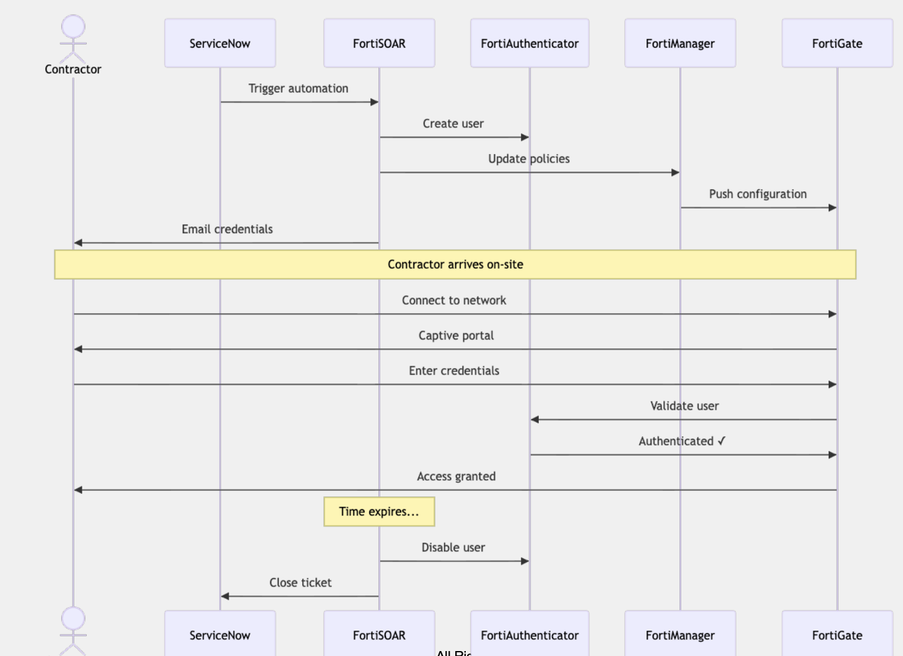

---

#### Sync SNOW User Requests

Using this playbook, open requests are retrieved from **ServiceNow**, and groups are fetched from **FortiAuthenticator**
for access assignment processing.

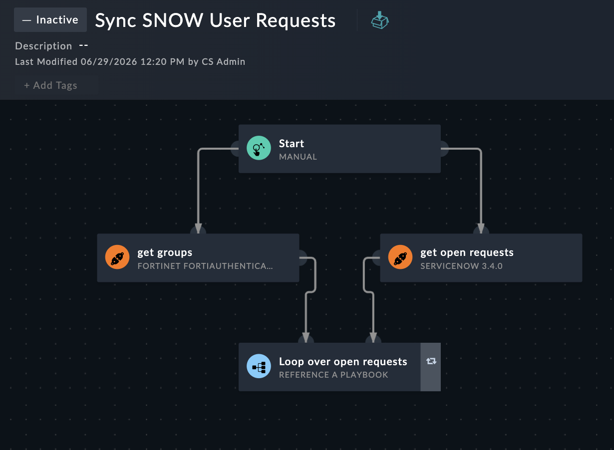

---

#### Create new Task Record

Using this playbook, a new network request task record is created in **ServiceNow** to track onboarding and provisioning
workflow execution.

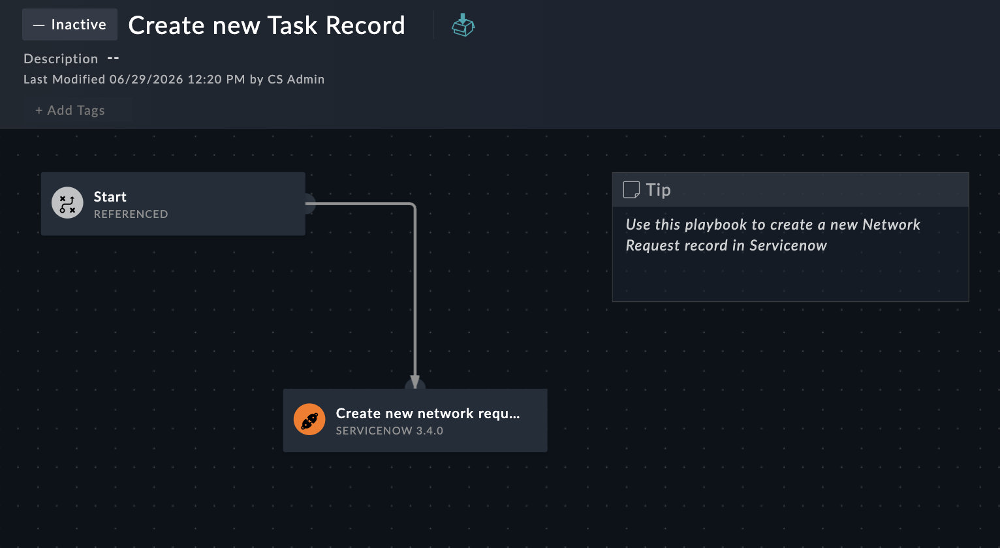

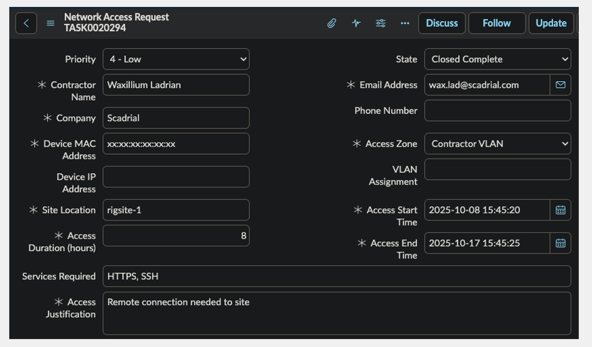

---

#### Create FAC User Per Task Found

Using this playbook, the workflow automates user provisioning and group assignment in **FortiAuthenticator**, while
maintaining synchronization and status updates in **ServiceNow**.

The workflow performs the following actions:

* Validates user information.
* Checks whether the user already exists.
* Creates users if required.
* Assigns users to the appropriate group.
* Updates ServiceNow with provisioning results.

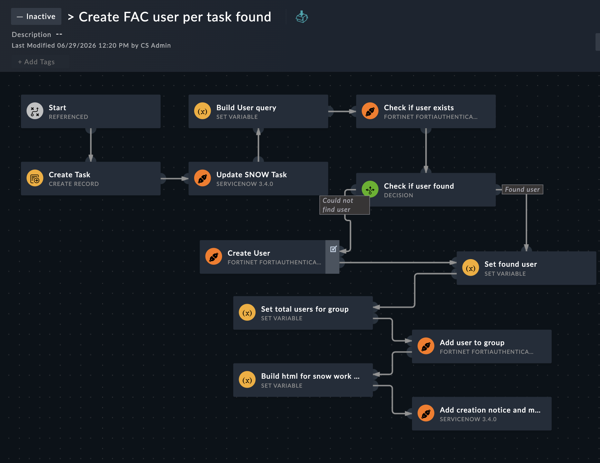

---

This automation reduces manual effort for user onboarding and ensures consistent access provisioning.

---

## FortiGate Alerting

---

This scenario processes operational alerts received from **FortiGate** through webhook integration and correlates them
with **ServiceNow** records.

Navigate to the generated alert and note the following:

* Alerts are triggered through **FortiGate Webhook** integration.
* Device information is extracted and processed automatically.
* Events are correlated with ServiceNow operational records.
* The alert contains:

    * Device serial number
    * Event information
    * Asset details
    * ServiceNow CI records
    * Change monitoring details

---

### Automated Workflow Processing

Users can launch the following playbooks:

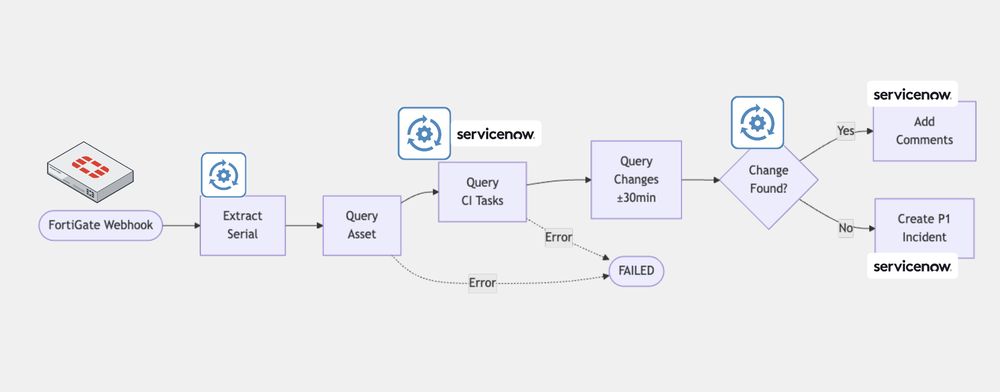

---

#### Receive FortiGate Trigger

This playbook correlates FortiGate-triggered events with **ServiceNow** change records and determines whether to update
an existing change record or create a new **P1 Incident**.

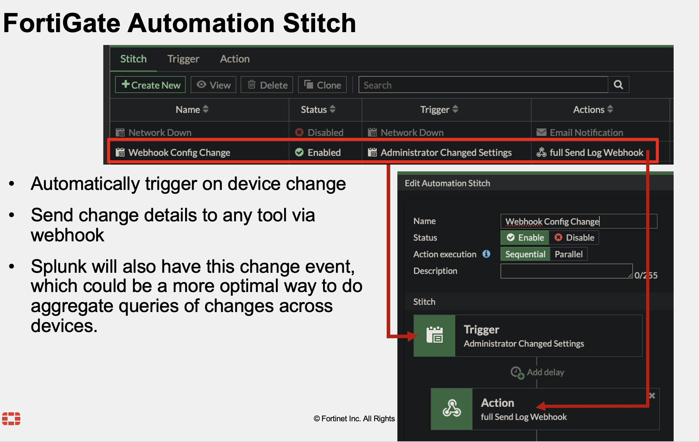

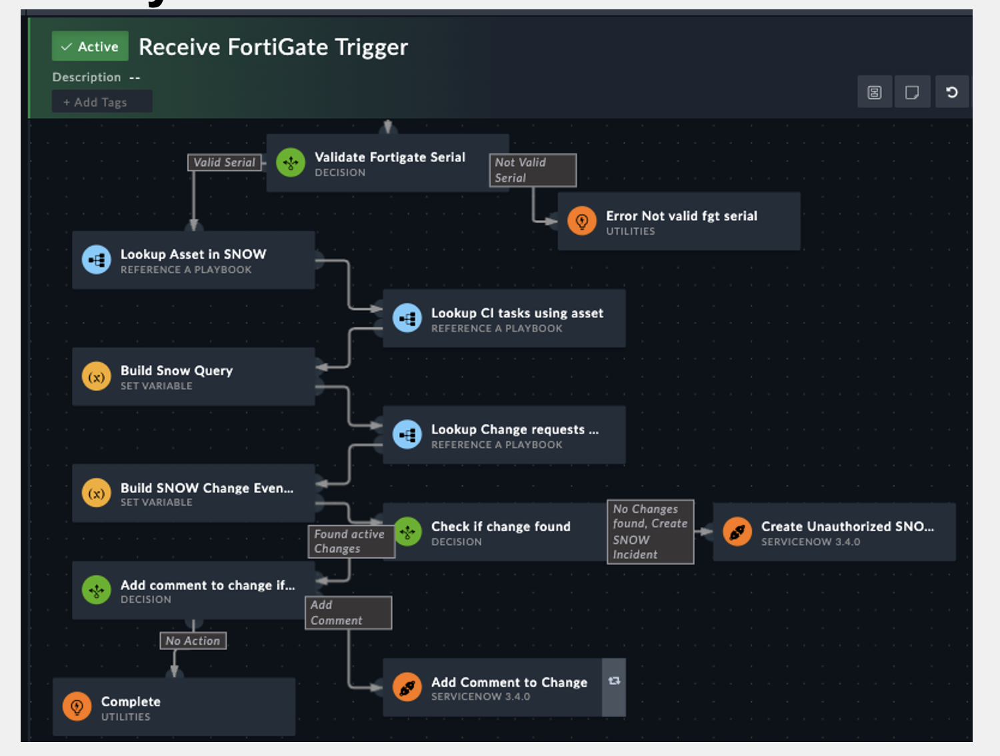

---

#### Snow Firewall Asset Query

Using this playbook, the extracted serial number is used to query the asset inventory and retrieve the corresponding
asset details.

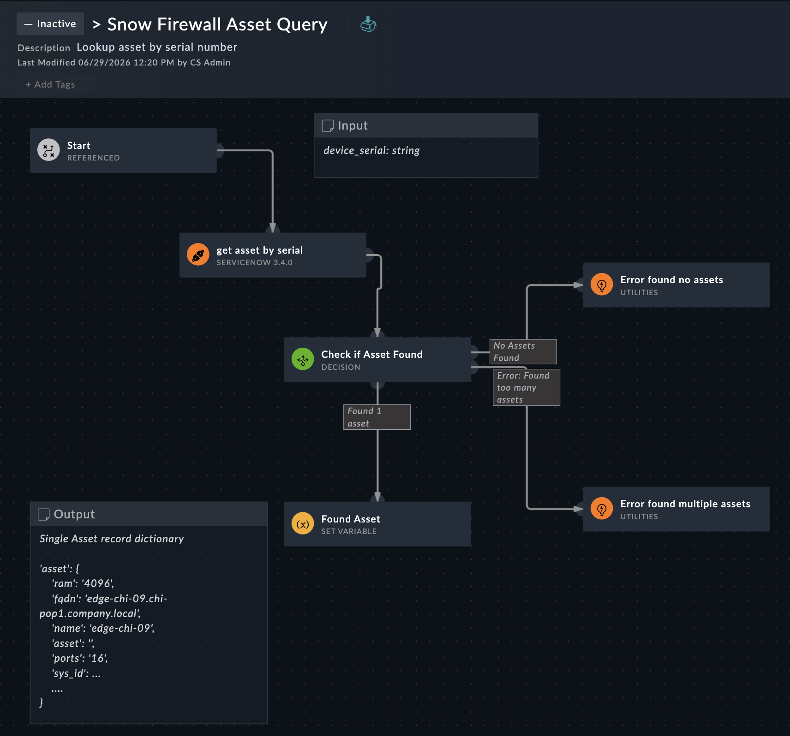

---

#### Snow Task CI Query

Using this playbook, the asset information is used to query the associated **ServiceNow CI Tasks** for that asset.

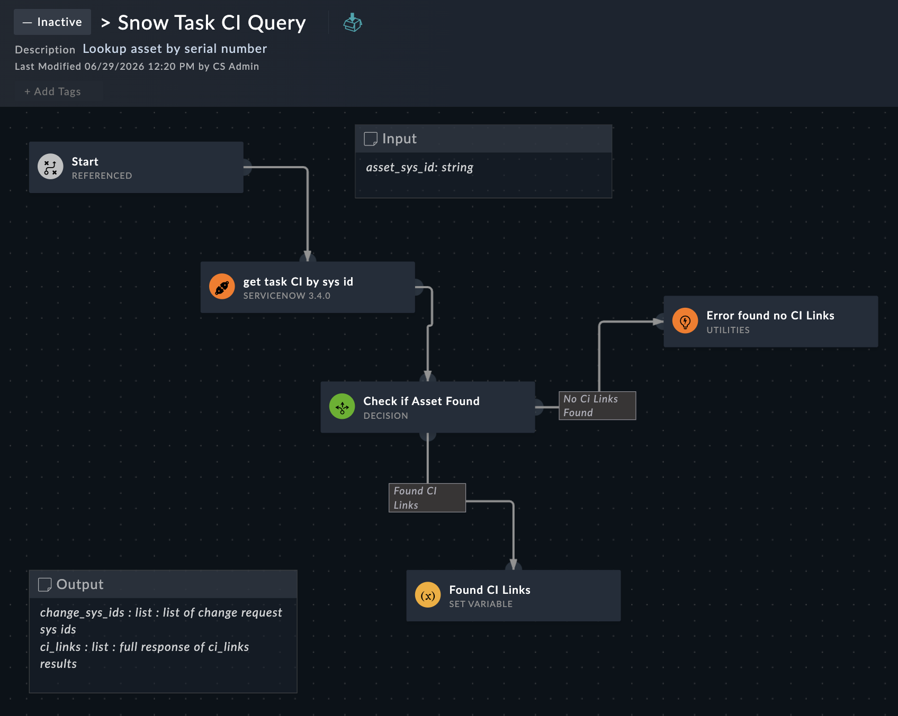

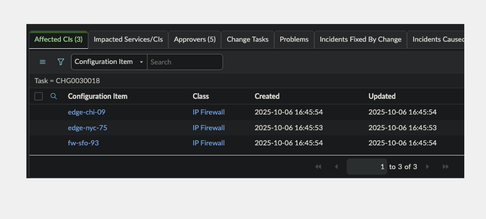

---

#### Snow Change Query

Using this playbook, the workflow identifies any configuration or operational changes that occurred within a *
*±30-minute window** of the event time.

The workflow performs the following actions:

* Evaluates related change activities.
* Determines whether an operational change exists.
* Updates an existing ServiceNow record if a change is found.
* Creates a **Priority 1 (P1) Incident** if no related change is identified.

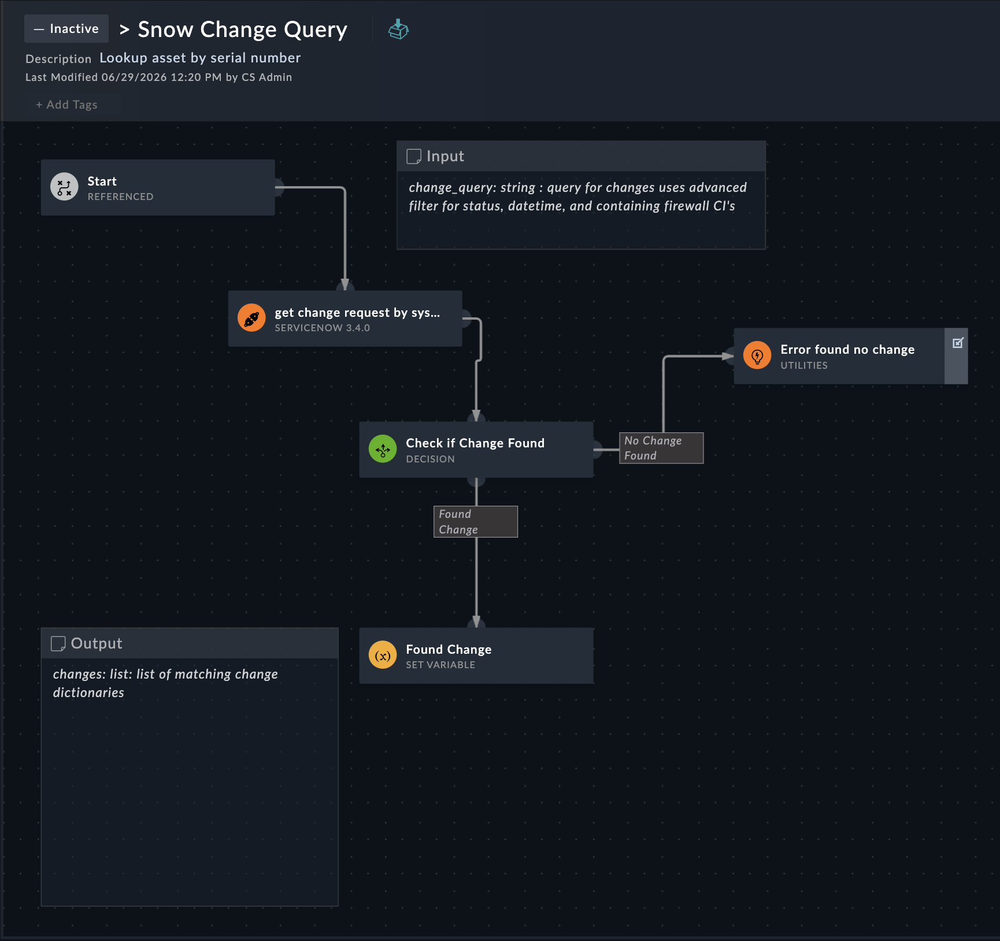

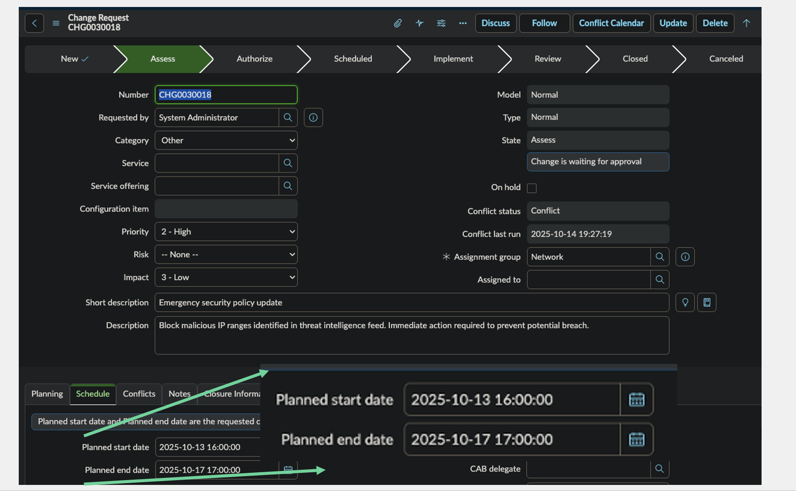

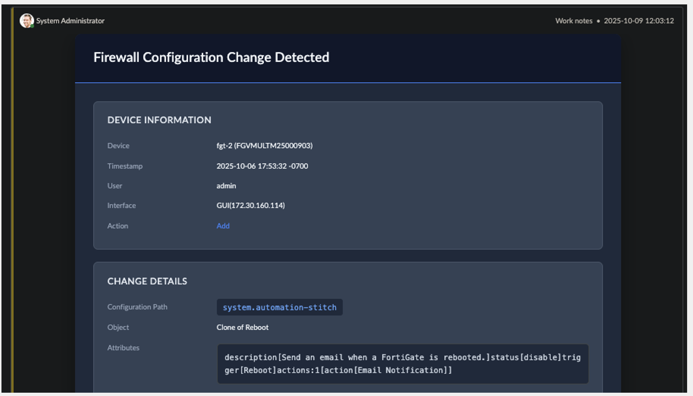

---

This automation improves operational visibility by correlating FortiGate alerts with change management activities and
automatically initiating incident response workflows.

---